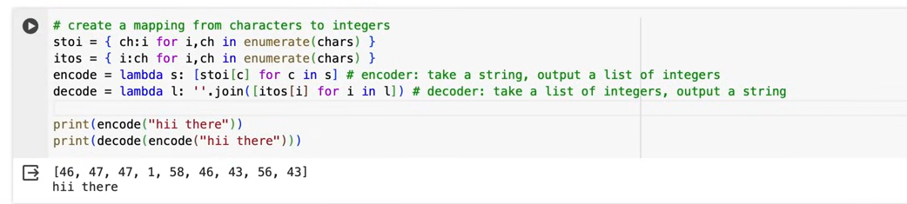
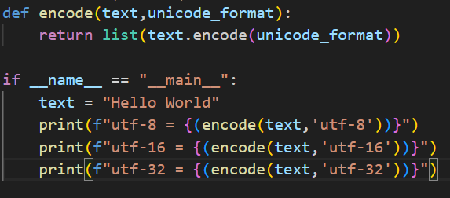
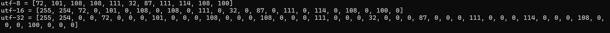

## Tokenization

- ie: Notes from  Karpathy's GPT Tokenizer


- In his previous examples He did


**Character Level tokenizer**  
- Created mapping for each strings  
    - assigned unique characters for each string
    - And that he used to encode and decode the strings
      


[Tokenizer Live Demo:](https://tiktokenizer.vercel.app/)

Goal: tokenize texts in form of some integers using fixed vocabulary


String: Set of characters stored as sequence of elements using some character coding(ie: Unicode(ie: UTF-8))

To See the Unicode value of a String in Python:ex: Ord('z')


[Programmers Introduction to Unicode](https://www.reedbeta.com/blog/programmers-intro-to-unicode/)


Experiments:

- [x] See How Does a String in UTF-8, UTF-16 and UTF-32 encodes
    - Code: "Hello world".encode('utf-8') ... do it simililiarly for UTF-16 and UTF-32
    
    


## Byte Pair Encoding Algorithmm:

Let's take an Example and Understand:  

Suppose We have a String:   aaabdaaabac

- Let Z=aa --> ZabdZabac
- Let Y=ab --> ZYdZYac
- Let X=ZY --> XdXac 

So this is how BPE algorithm Works

- [x] Step 1:
    - encode String using UTF-8 format and Store the Bytes
    - Convert the Bytes to Integer
    - And Store it as a List and Print it

- [x] Step 2:
    - Create the List of all Common pairs of characters
    - Iterate consecutive elements and find all the pairs and it's Counts
    - Sorted from Highest Count to lowest

- [ ] Step 3:
    - function Name --> Merge
    - take the List of Original List of Charactest and replace the Most Commonly Ocuring pair of Bytes with a Different Byte Denoting that pair
    - Suppose encoding ranges from  0 - 255, You can replace Highest Occuring pair With 255+1 = 256
    - Write a Function which takes input: (original_array, pair_of_array_that_needs_to_be_replaced,value_that_will_be_replaced_with)

- [ ] Step 4:
    - Based on Your preference choose a Hyperparmeter --> How many times you want to conduct merge operation 
    - based on Hyperparameter loop and merge all from the Lists

- [ ] Step 5:
    - Calculate the Compression Ratio  ie: Calculate How much have you compressed the original array
    - Come up with the formula

## Here is How Our End Goal Should Look Like =:

```Python

def encode(text):
    return "list of encoded bytes"

def decode(bytes:list[int]):
    return "Original String"
```

- [ ] Step 6:
    - write a function to decode string to it's original string
    - Some Strings might not follow UTF-8 standard ---> Use bytes.decode("utf-8",errors="replace")
    - #research about the above point with example of 128 --> Wrong Case 97 --> Correct Case

- [ ] Step 7:
    - Write a function to encode a String based on the output of our BPE model
    - given a string, return a List of characters
> **NOTE**  Confused about the implementation at: 52:31 in the video
- Come Up with your own implementation for encode and decode 

- [ ] Step 8:
    - Test with Different cases to See if it Works


### To Be Continued....... State of the Art Techniques

